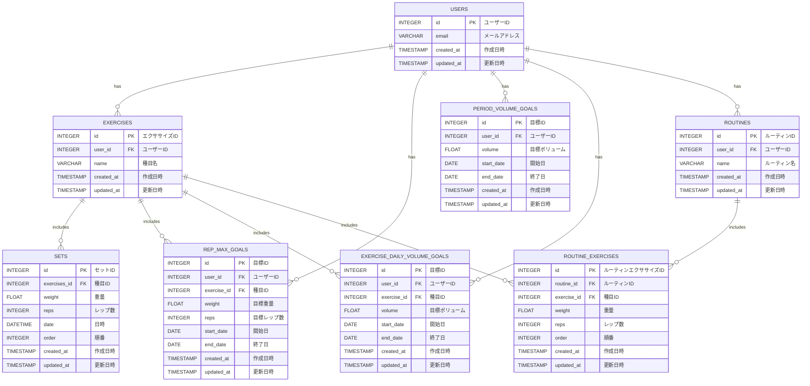

# ER図

```mermaid
erDiagram
    USERS {
        INTEGER id PK "ユーザーID"
        VARCHAR email "メールアドレス"
        TIMESTAMP created_at "作成日時"
        TIMESTAMP updated_at "更新日時"
    }
    
    SETS {
        INTEGER id PK "セットID"
        INTEGER exercises_id FK "種目ID"
        FLOAT weight "重量"
        INTEGER reps "レップ数"
        DATETIME date "日時"
        INTEGER order "順番"
        TIMESTAMP created_at "作成日時"
        TIMESTAMP updated_at "更新日時"
    }
    
    EXERCISES {
        INTEGER id PK "エクササイズID"
        INTEGER user_id FK "ユーザーID"
        VARCHAR name "種目名"
        TIMESTAMP created_at "作成日時"
        TIMESTAMP updated_at "更新日時"
    }
    
    REP_MAX_GOALS {
        INTEGER id PK "目標ID"
        INTEGER user_id FK "ユーザーID"
        INTEGER exercise_id FK "種目ID"
        FLOAT weight "目標重量"
        INTEGER reps "目標レップ数"
        DATE start_date "開始日"
        DATE end_date "終了日"
        TIMESTAMP created_at "作成日時"
        TIMESTAMP updated_at "更新日時"
    }
    
    PERIOD_VOLUME_GOALS {
        INTEGER id PK "目標ID"
        INTEGER user_id FK "ユーザーID"
        FLOAT volume "目標ボリューム"
        DATE start_date "開始日"
        DATE end_date "終了日"
        TIMESTAMP created_at "作成日時"
        TIMESTAMP updated_at "更新日時"
    }
    
    EXERCISE_DAILY_VOLUME_GOALS {
        INTEGER id PK "目標ID"
        INTEGER user_id FK "ユーザーID"
        INTEGER exercise_id FK "種目ID"
        FLOAT volume "目標ボリューム"
        DATE start_date "開始日"
        DATE end_date "終了日"
        TIMESTAMP created_at "作成日時"
        TIMESTAMP updated_at "更新日時"
    }
    
    ROUTINES {
        INTEGER id PK "ルーティンID"
        INTEGER user_id FK "ユーザーID"
        VARCHAR name "ルーティン名"
        TIMESTAMP created_at "作成日時"
        TIMESTAMP updated_at "更新日時"
    }
    
    ROUTINE_EXERCISES {
        INTEGER id PK "ルーティンエクササイズID"
        INTEGER routine_id FK "ルーティンID"
        INTEGER exercise_id FK "種目ID"
        FLOAT weight "重量"
        INTEGER reps "レップ数"
        INTEGER order "順番"
        TIMESTAMP created_at "作成日時"
        TIMESTAMP updated_at "更新日時"
    }
    
    USERS ||--o{ EXERCISES : "has"
    USERS ||--o{ REP_MAX_GOALS : "has"
    USERS ||--o{ PERIOD_VOLUME_GOALS : "has"
    USERS ||--o{ EXERCISE_DAILY_VOLUME_GOALS : "has"
    USERS ||--o{ ROUTINES : "has"
    EXERCISES ||--o{ SETS : "includes"
    EXERCISES ||--o{ REP_MAX_GOALS : "includes"
    EXERCISES ||--o{ EXERCISE_DAILY_VOLUME_GOALS : "includes"
    ROUTINES ||--o{ ROUTINE_EXERCISES : "includes"
    EXERCISES ||--o{ ROUTINE_EXERCISES : "includes"
```
