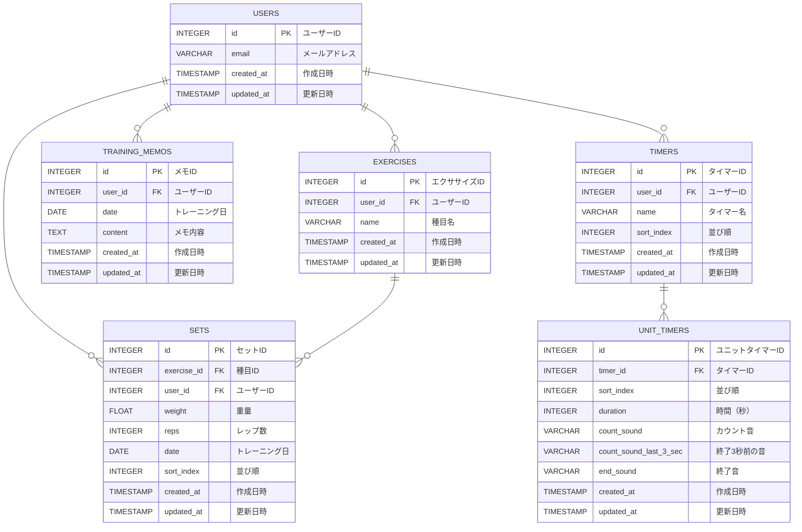

# ER図

```mermaid
erDiagram
    USERS {
        INTEGER id PK "ユーザーID"
        VARCHAR email "メールアドレス"
        TIMESTAMP created_at "作成日時"
        TIMESTAMP updated_at "更新日時"
    }

    SETS {
        INTEGER id PK "セットID"
        INTEGER exercise_id FK "種目ID"
        INTEGER user_id FK "ユーザーID"
        FLOAT weight "重量"
        INTEGER reps "レップ数"
        DATE date "トレーニング日"
        INTEGER sort_index "並び順"
        TIMESTAMP created_at "作成日時"
        TIMESTAMP updated_at "更新日時"
    }

    EXERCISES {
        INTEGER id PK "エクササイズID"
        INTEGER user_id FK "ユーザーID"
        VARCHAR name "種目名"
        TIMESTAMP created_at "作成日時"
        TIMESTAMP updated_at "更新日時"
    }

    TRAINING_MEMOS {
        INTEGER id PK "メモID"
        INTEGER user_id FK "ユーザーID"
        DATE date "トレーニング日"
        TEXT content "メモ内容"
        TIMESTAMP created_at "作成日時"
        TIMESTAMP updated_at "更新日時"
    }

    TIMERS {
        INTEGER id PK "タイマーID"
        INTEGER user_id FK "ユーザーID"
        VARCHAR name "タイマー名"
        INTEGER sort_index "並び順"
        TIMESTAMP created_at "作成日時"
        TIMESTAMP updated_at "更新日時"
    }

    UNIT_TIMERS {
        INTEGER id PK "ユニットタイマーID"
        INTEGER timer_id FK "タイマーID"
        INTEGER sort_index "並び順"
        INTEGER duration "時間（秒）"
        VARCHAR count_sound "カウント音"
        VARCHAR count_sound_last_3_sec "終了3秒前の音"
        VARCHAR end_sound "終了音"
        TIMESTAMP created_at "作成日時"
        TIMESTAMP updated_at "更新日時"
    }

    USERS ||--o{ EXERCISES : ""
    USERS ||--o{ SETS : ""
    USERS ||--o{ TRAINING_MEMOS : ""
    USERS ||--o{ TIMERS : ""
    EXERCISES ||--o{ SETS : ""
    TIMERS ||--o{ UNIT_TIMERS : ""
```
