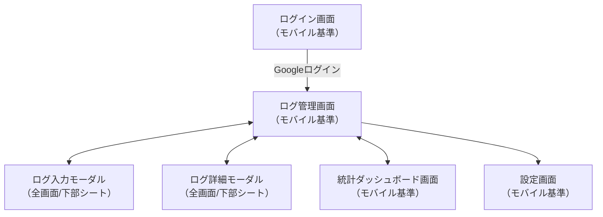

# 画面遷移図

```mermaid
graph TD;
    LoginScreen[ログイン画面\n（モバイル基準）]
    LogManagementScreen[ログ管理画面\n（モバイル基準）]
    LogInputModal[ログ入力モーダル\n（全画面/下部シート）]
    LogDetailModal[ログ詳細モーダル\n（全画面/下部シート）]
    StatisticsDashboardScreen[統計ダッシュボード画面\n（モバイル基準）]
    SettingsScreen[設定画面\n（モバイル基準）]

    LoginScreen -->|Googleログイン| LogManagementScreen
    LogManagementScreen <--> LogInputModal
    LogManagementScreen <--> LogDetailModal
    LogManagementScreen <--> StatisticsDashboardScreen
    LogManagementScreen --> SettingsScreen
```
