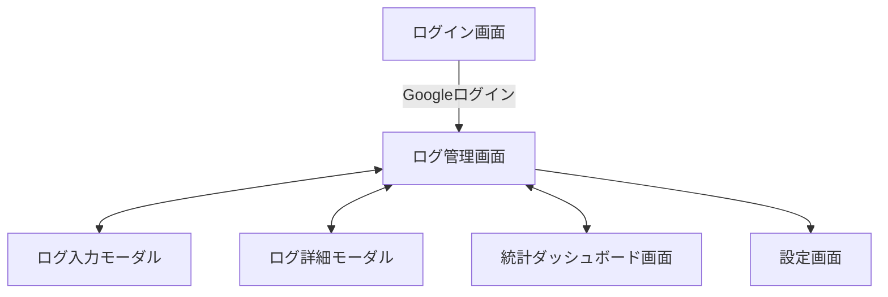

# 画面遷移図

```mermaid
graph TD;
    LoginScreen[ログイン画面]
    LogManagementScreen[ログ管理画面]
    LogInputModal[ログ入力モーダル]
    LogDetailModal[ログ詳細モーダル]
    StatisticsDashboardScreen[統計ダッシュボード画面]
    SettingsScreen[設定画面]

    LoginScreen -->|Googleログイン| LogManagementScreen
    LogManagementScreen <--> LogInputModal
    LogManagementScreen <--> LogDetailModal
    LogManagementScreen <--> StatisticsDashboardScreen
    LogManagementScreen --> SettingsScreen
```
