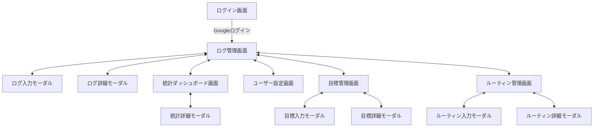
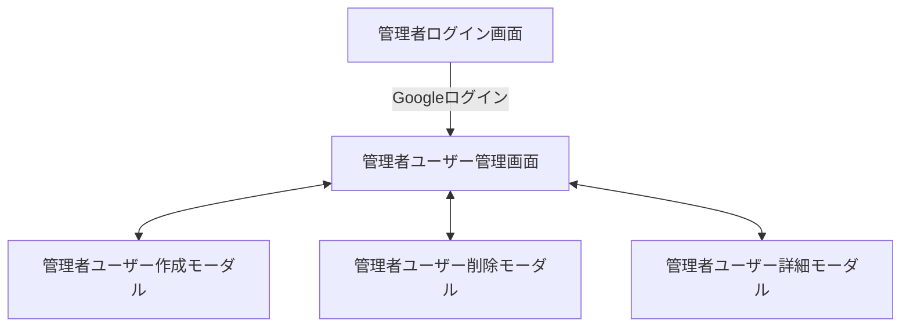

# 画面遷移図
## ユーザー向け

```mermaid
graph TD;
    LoginScreen[ログイン画面]
    LogManagementScreen[ログ管理画面]
    LogInputModal[ログ入力モーダル]
    LogDetailModal[ログ詳細モーダル]
    StatisticsDashboardScreen[統計ダッシュボード画面]
    StatisticsDetailModal[統計詳細モーダル]
    UserSettingsScreen[ユーザー設定画面]
    GoalManagementScreen[目標管理画面]
    GoalInputModal[目標入力モーダル]
    GoalDetailModal[目標詳細モーダル]
    RoutineManagementScreen[ルーティン管理画面]
    RoutineInputModal[ルーティン入力モーダル]
    RoutineDetailModal[ルーティン詳細モーダル]

    LoginScreen -->|Googleログイン| LogManagementScreen
    LogManagementScreen <--> LogInputModal
    LogManagementScreen <--> LogDetailModal
    LogManagementScreen <--> StatisticsDashboardScreen
    LogManagementScreen <--> UserSettingsScreen
    LogManagementScreen <--> GoalManagementScreen
    LogManagementScreen <--> RoutineManagementScreen
    StatisticsDashboardScreen <--> StatisticsDetailModal
    GoalManagementScreen <--> GoalInputModal
    GoalManagementScreen <--> GoalDetailModal
    RoutineManagementScreen <--> RoutineInputModal
    RoutineManagementScreen <--> RoutineDetailModal
```

## 管理者向け（認可機能）

```mermaid
graph TD;
    AdminLoginScreen[管理者ログイン画面]
    AdminUserManagementScreen[管理者ユーザー管理画面]
    AdminUserCreateModal[管理者ユーザー作成モーダル]
    AdminUserDeleteModal[管理者ユーザー削除モーダル]
    AdminUserDetailModal[管理者ユーザー詳細モーダル]

    AdminLoginScreen -->|Googleログイン| AdminUserManagementScreen
    AdminUserManagementScreen <--> AdminUserCreateModal
    AdminUserManagementScreen <--> AdminUserDeleteModal
    AdminUserManagementScreen <--> AdminUserDetailModal
```
